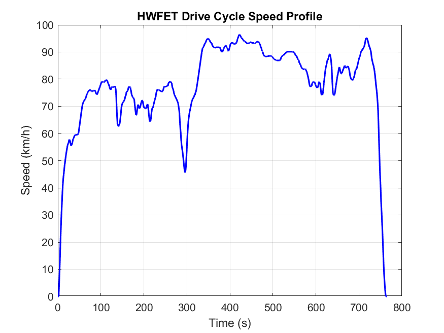
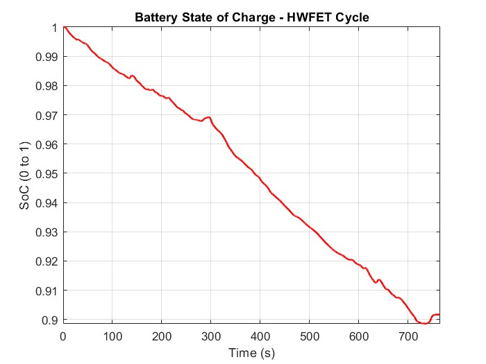
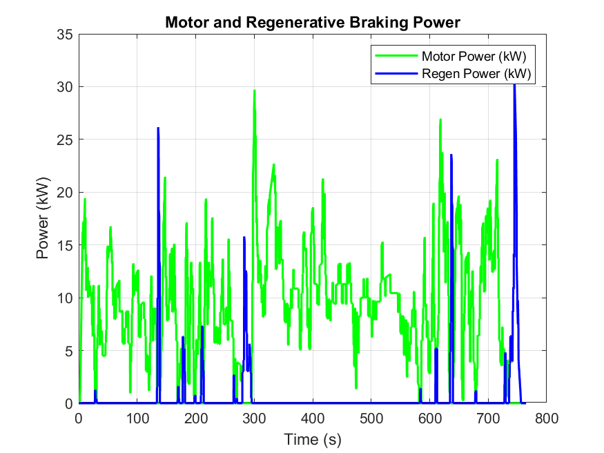
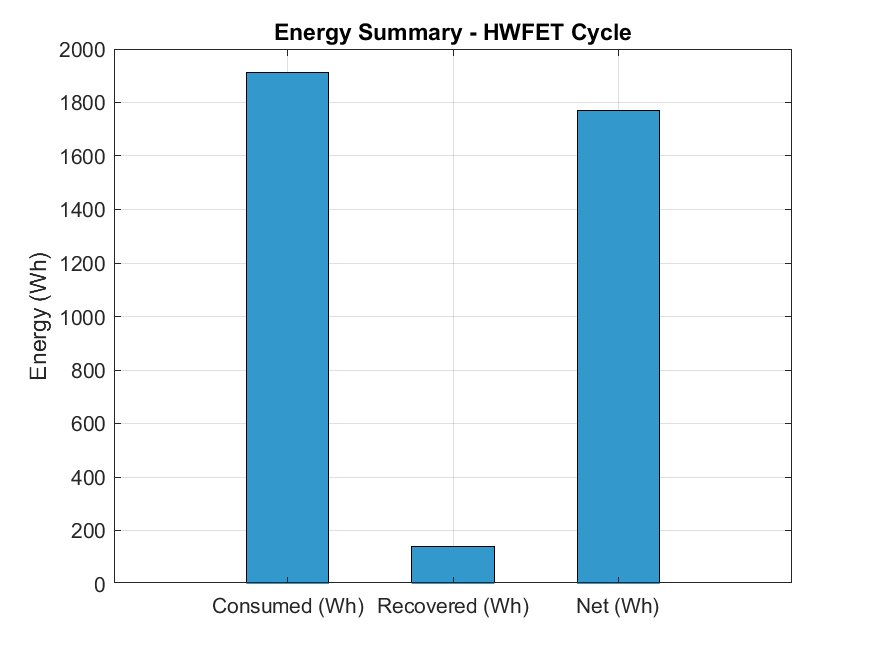

# EV Drive Cycle Simulation — HWFET Cycle (MATLAB/Simulink)

## Overview
A full electric vehicle powertrain simulation running the EPA HWFET 
(Highway Fuel Economy Test) drive cycle, built in MATLAB/Simulink.

## Model Architecture
- **Drive Cycle Input** — EPA HWFET data at 10 Hz (hwy10hztable.txt)
- **Vehicle Dynamics** — Aerodynamic drag, rolling resistance, inertia
- **Braking Controller** — Speed-based regenerative braking logic
- **Motor & Power** — Motor efficiency model (92% motoring, 85% regen)
- **Battery SoC** — Coulomb counting model (50Ah, 360V pack)

## Vehicle Parameters
| Parameter | Value |
|---|---|
| Mass | 1500 kg |
| Drag Coefficient | 0.28 |
| Frontal Area | 2.2 m² |
| Rolling Resistance | 0.01 |
| Battery Capacity | 50 Ah / 360V |

## Results
| Metric | Value |
|---|---|
| Distance Simulated | 16.51 km |
| Energy Consumed | 1910 Wh |
| Energy Recovered (Regen) | 140.5 Wh |
| Regen Recovery | 7.4% |
| Efficiency | 107 Wh/km |
| Estimated Range | 168 km |
| SoC Drop per Cycle | ~10% |

## Key Insight
Highway cycles show lower regen recovery (7.4%) compared to city cycles 
due to fewer braking events — explaining why EVs are more efficient in 
city driving than on highways, opposite to ICE vehicles.

## Plots

## Tools Used
- MATLAB / Simulink
- EPA HWFET Drive Cycle Data

## Author
Shashwat Sinha — Mechanical Engineering, Delhi Technological University
